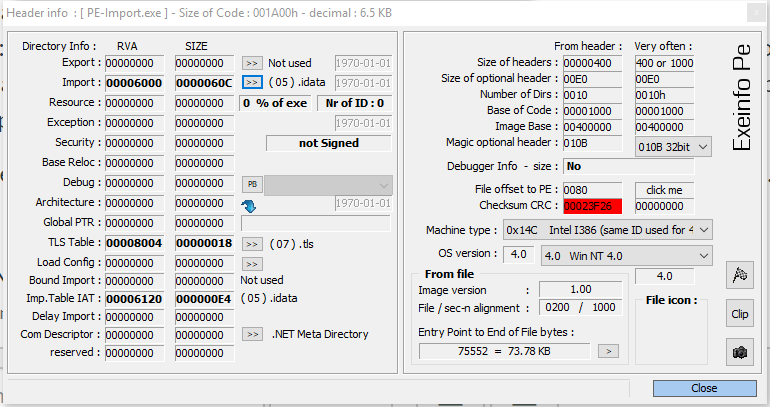
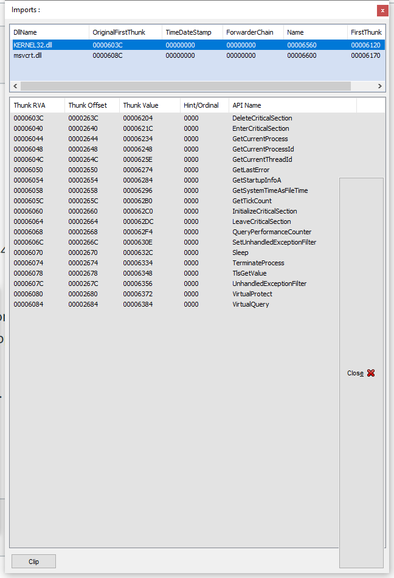
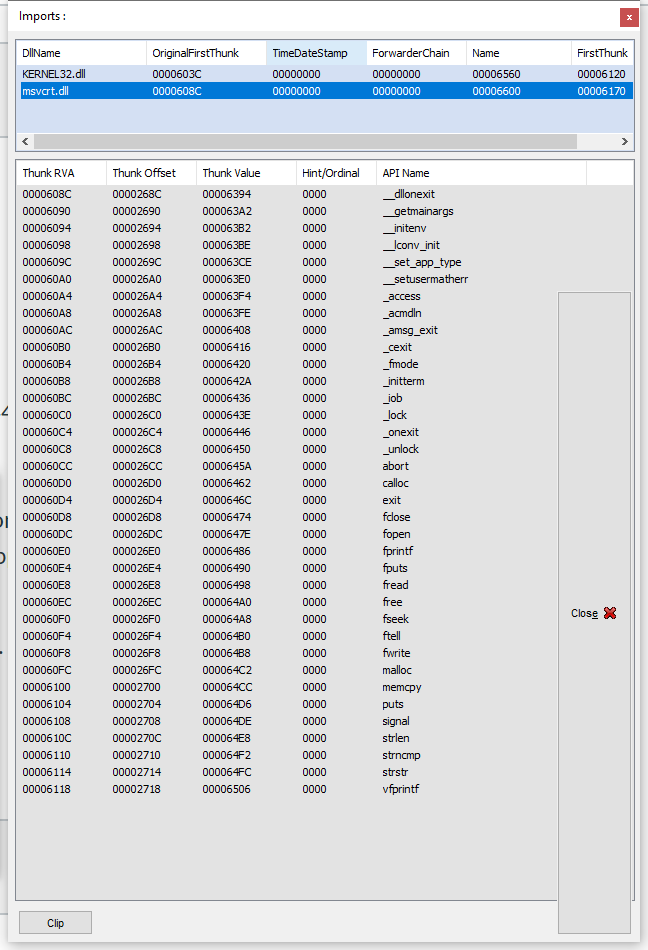
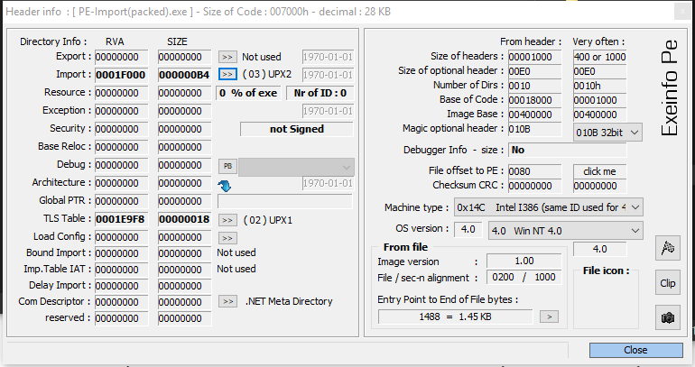
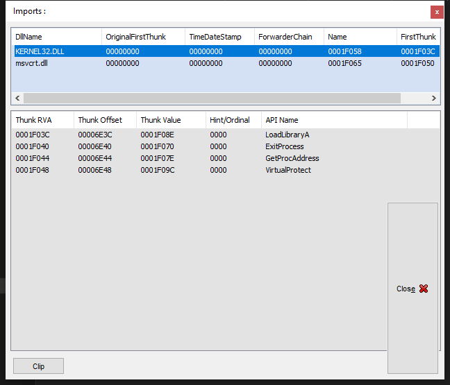
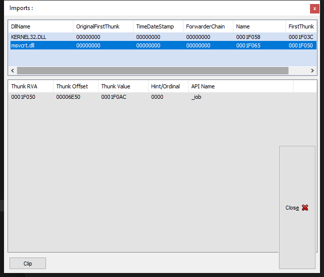
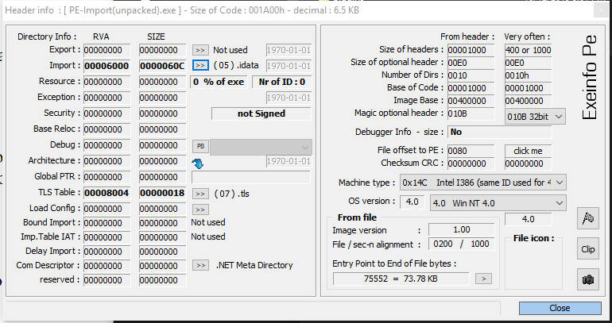
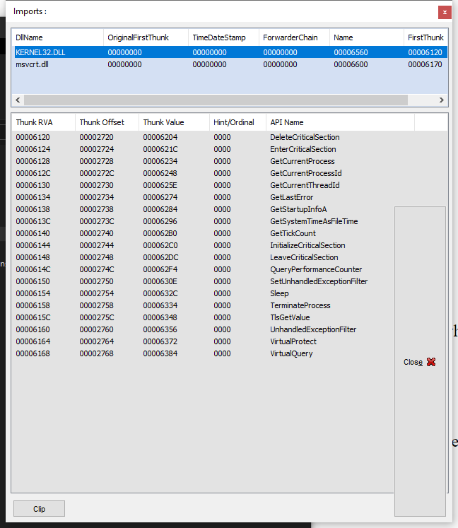
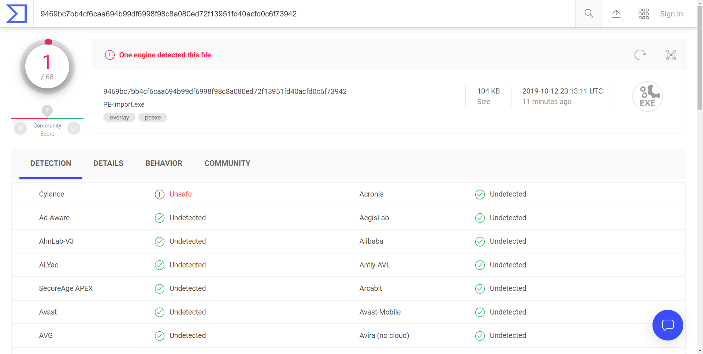
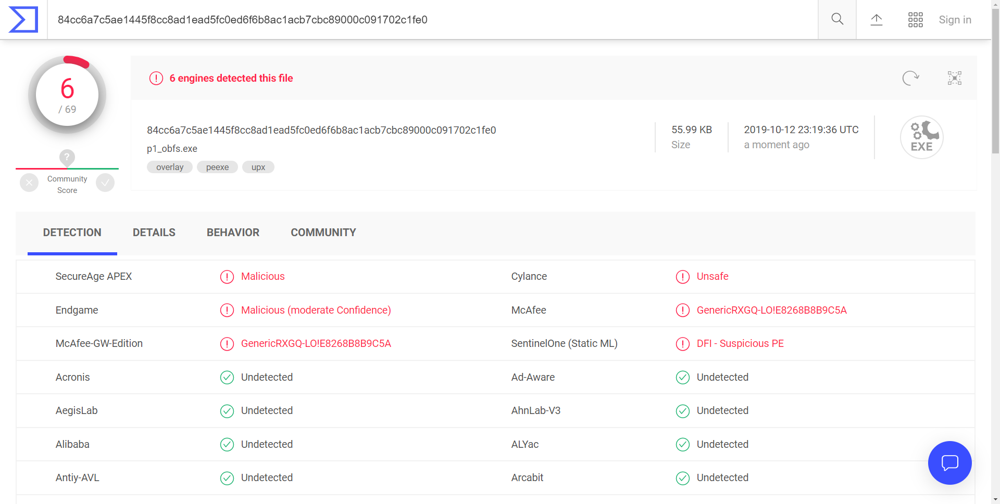

# Homework 2 Problem 1

  Yue Shu (yxs626)  
  EECS444  
  Prof. Ye  
  October 12, 2019  

## Step 1

See `./src/p1.c` for the source code of this step. Feel free to run the following commands to see the functionality of the program as the output below:

```cmd
$ make all
gcc p1.c -o p1
gcc p1_obfs.c -o p2
$ ./p1
I want to learn PE file format!
```

## Step 2

Below is the header and import table of the original compiled executable file `./exe/PE-Import.exe`:




## Step 3

### Step 3.1

See `./exe/PE-Import(packed).exe` for the executable file packed by UPX.

### Step 3.2

Below is the header and import table of the executable file packed by UPX:




### Step 3.3

  See `./exe/PE-Import(unpacked).exe` for the executable file unpacked by UPX again.  
  Below is the header and import table for this executable file:





## Step 4

Let's take a look at the original detection result of `PE-Import.exe` on VirusTotal:



As above, only one engine detected the file as a virus.

To fool the detectors, I first thought about packing the executable multiple times. However, the packer I downloaded namely ASPack did not allow me to do so, saying the file is already packed. So I decided to do some obfuscation and encryption in my code.

In `./src/p1_obfs.c`, I first changed the naming of variables and comments in the code to something irrelevant: openning a socket. Then I encrypted all the string values with a hex encrypter. Finally, I packed the compiled executable with UPX to make it seems more suspicious. As a wrap up, I also made the code very unreadable by piling the loc together.

Notably, if you look deep enough at the source code, the new program did nothing different with the original program, and the functionalities are all exactly the same.

Now let's take a look at the final result:



Given that the program doesn't contain any malicious line of code at all, I would say roughly a 10% false positive rate is good enough for me. The assignment didn't make it clear about whether or not we are allowed to add more functionalities in the code or even change the performance (for example, adding buffer overflow, starting new shell, adding unnecessary loops, etc.), so I didn't do any of these. Otherwise, I believe the percentage would be a lot higher.
