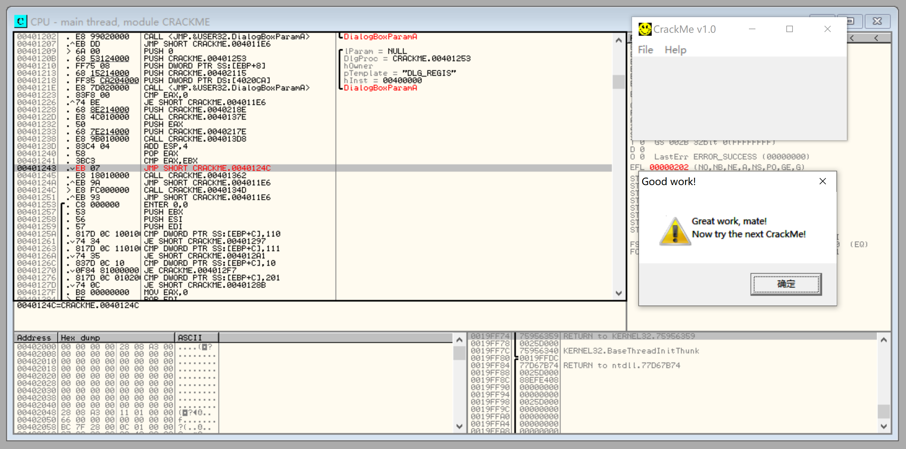
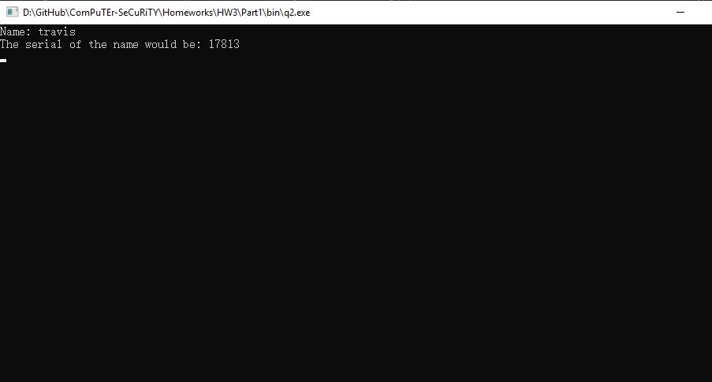
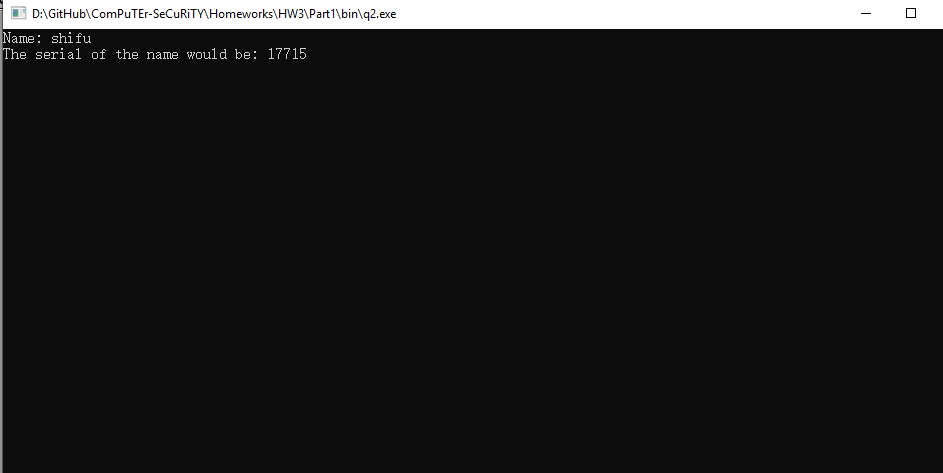
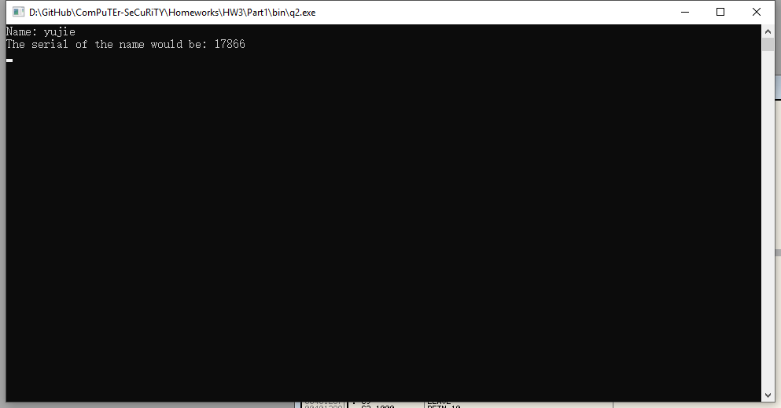
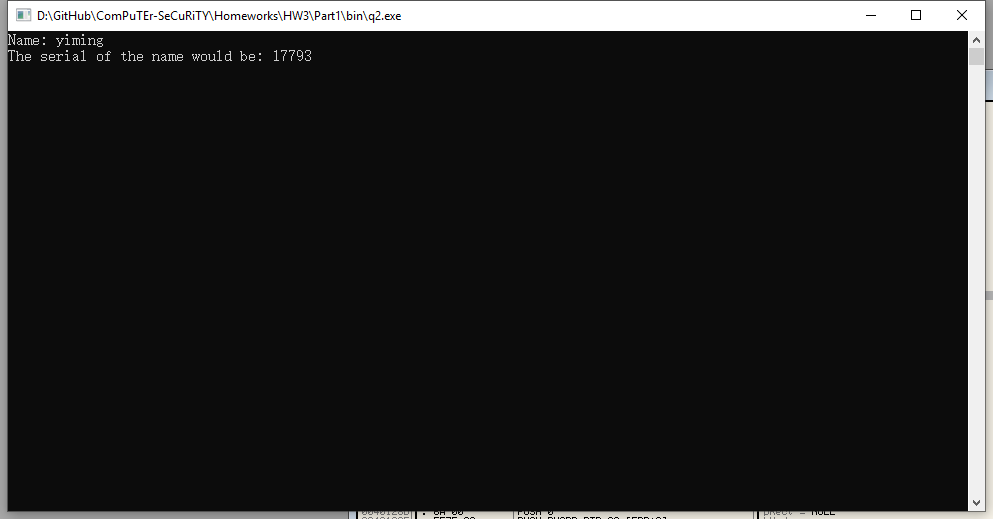
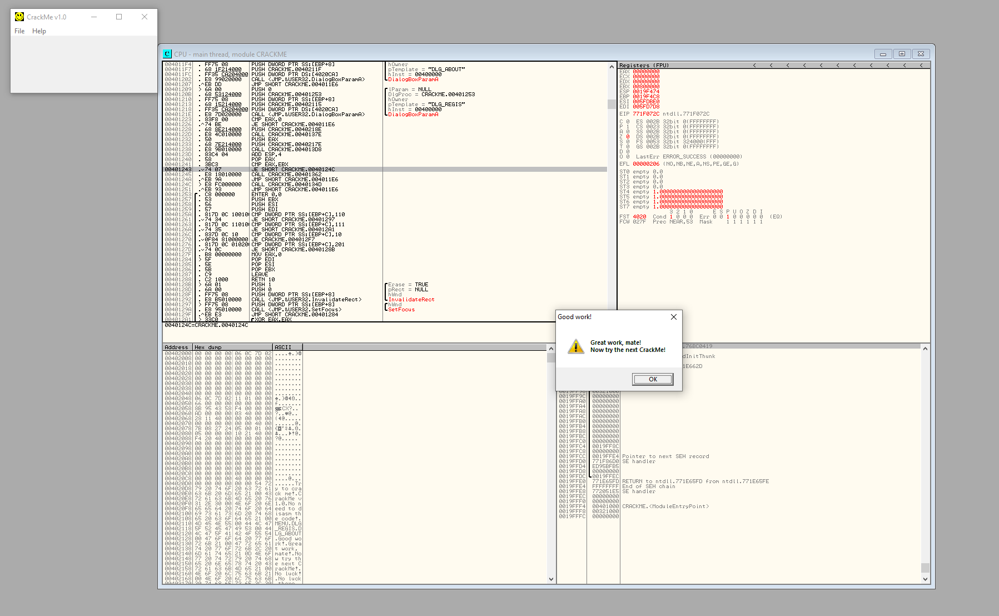

# Homework 3 Part 1

  Yue Shu (yxs626)  
  EECS444  
  Prof. Ye  
  October 29, 2019

> NOTE: All C source code are saved under the `src` directory and all executable binary files are saved under the `bin` directory. You can also test the program results by manually compiling the source codes using the `makefile` I provided ahead of time.

## Question 1

For this problem, generally the idea is to modify the line of code as I highlighted below so that the input will pass validation and jump to the success message box no matter what.

## Question 2

For this problem, after fully inspecting the code I figured that the assembly code basically turns all characters in the name input to uppercase, computes the sum of the ASCII values of each character, then finally performs XOR bit manipulation with `0x1234` and `0x5678` to get the correct serial value.

Therefore, as long as the serial input matches with the result calculated as above, the inputs would pass validation and jump to the success message box. I have implemented a C program to compute the serial value. Feel free to read the source code in `./src/q2.c` or play with the executeable binary file in `./bin/q2.exe` to check the validity of the result. Screenshots of appropriate name-serial pair including three name inputs provided by the TAs in class are also attached below.

Below is a proof that the input passed the validation. I included the source code to prove that unlike the first question, the second question did not involve any modification on the original source code.

